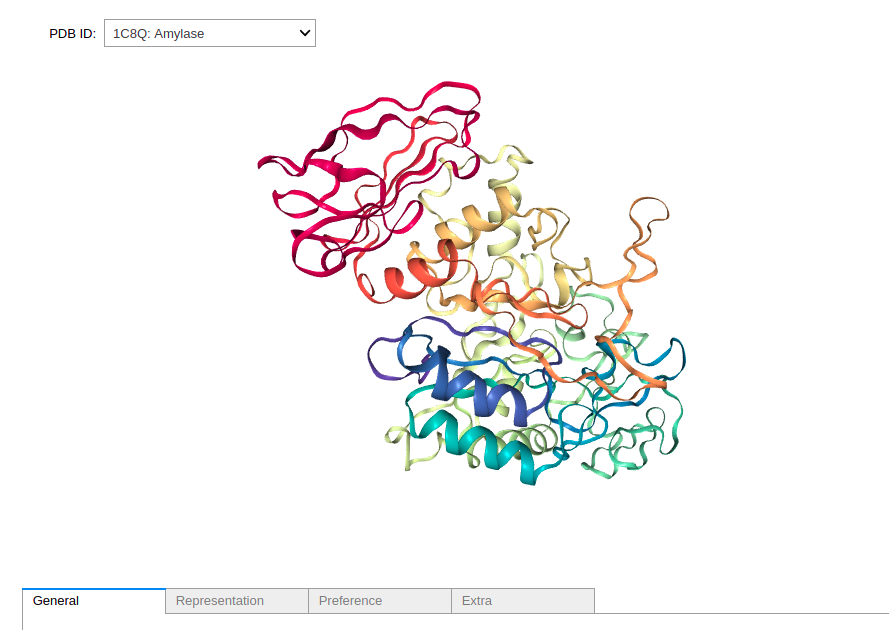
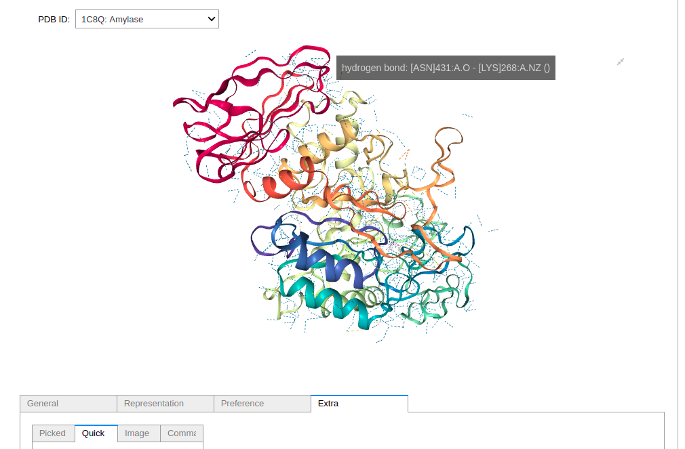
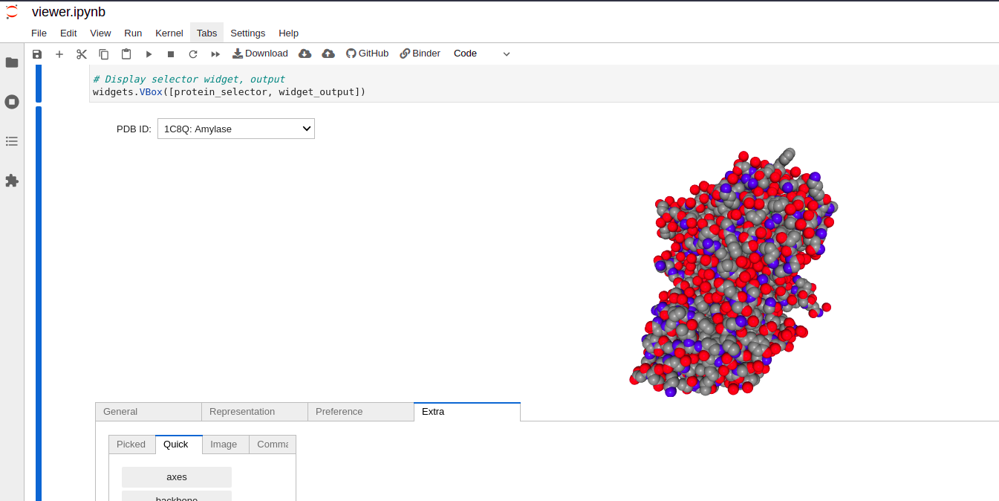

# 3-D Protein Visualizer with Biopython

## Table of Contents

<ol>
 <li><a href="#introduction">Introduction</a></li>
 <li><a href="#technologies">Technologies</a></li>
 <li><a href="#usage">Usage</a></li>
  <ol>
   <li><a href="#start-the-notebook">Start the notebook</a></li>
   <li><a href="#gui-reference">GUI reference</a></li>
  </ol>
 <li><a href="#author">Author</a></li>
 </ol>
 
## Introduction <a class="anchor" id="introduction"></a>

This project was primarily inspired by my background in molecular biology. I was excited to explore the biopython library and its uses, so I decided to create a Jupyter Notebook app.

I choose Jupyter Notebooks in part because they provide reasonable widget tooling, so making a GUI is relatively straightforward. The Notebooks are served by Binder, which remedies many of the traditional deployment challenges of Jupyter Notebooks.

While there is a small 10-20 second delay while the server spins up, Binder provides all the interactivity of a traditional Notebook but without much of the fuss.

## Technologies <a class="anchor" id="technologies"></a>
* Python
* Binder
* Jupyter notebooks
* Ipywidgets
* Biopython
* Nglview

## Usage

### Start the notebook <a class="anchor" id="start-the-notebook"></a>

1. Click the badge below to start the notebook.
    - [](https://mybinder.org/v2/gh/zachmichael14/protein_viewer/HEAD?labpath=viewer.ipynb)
    - A static version of the notebook will be displayed while the server spins up. 
  
 

### GUI reference <a class="anchor" id="gui-reference"></a>

There are several protein representations available, with different representation serving different purposes.

While much of the GUI functionality is geared toward creating custom representations, the current representation can most easily be changed by navigating to ```Extra > Quick``` and selecting a representation.


Note: Representations can stack and so will need to cycled on/off as desired.

"Cartoon" is typically the default as it's fairly easy to get a sense of the [motifs](https://bio.libretexts.org/Bookshelves/Cell_and_Molecular_Biology/Book%3A_Basic_Cell_and_Molecular_Biology_(Bergtrom)/03%3A_Details_of_Protein_Structure/3.06%3A_Protein_Domains_Motifs_and_Folds_in_Protein_Structure) that make up the protein.



The "contact" view represents distance between amino acids and has become increasingly useful for machine learning computations as these values are independent of model transformations. Here, a hydrogen bond between an Asparagine residue and a Lysine residue is highlighted.



"Spacefill" and "ball-and-stick" are both common representations of molecules in chemistry, though the latter is largely ignored by this GUI as most proteins would be too large to fit on screen if modeled accurately this way.



## Author

### Zachary Seitz

#### Let's connect!

* Find me on [Linkedin](https://linkedin.com/in/zachmichael14).
* Email me at zachmichael14@gmail.com.
* Visit my [resume website](https://zachmichael14.github.io/gh_page/).
