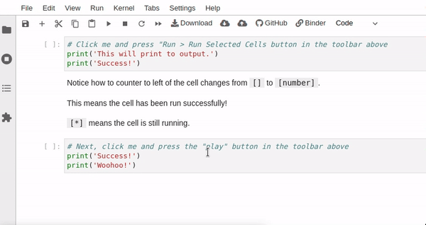
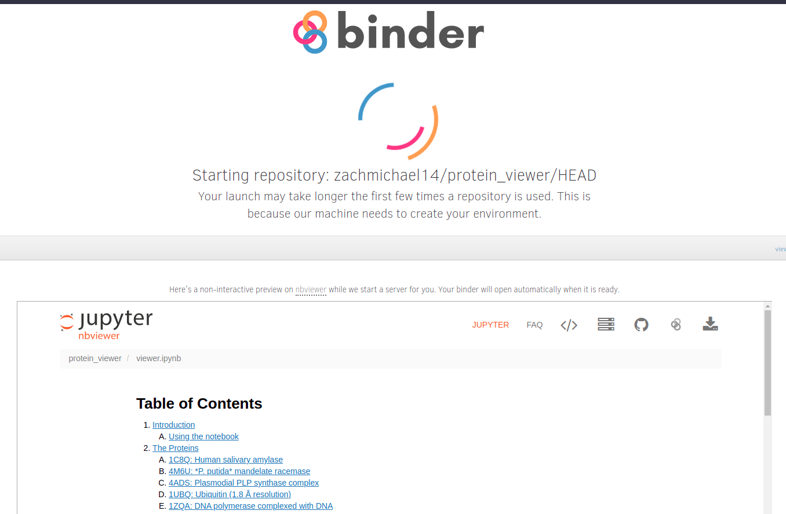
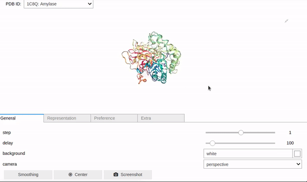
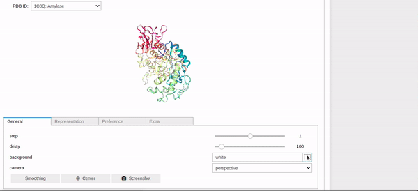
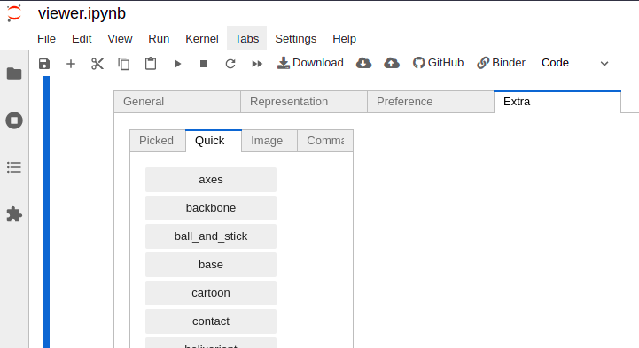
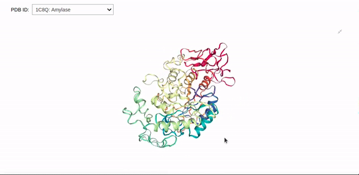
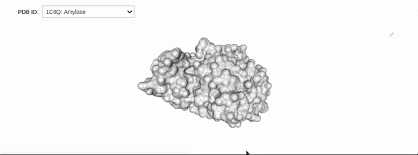
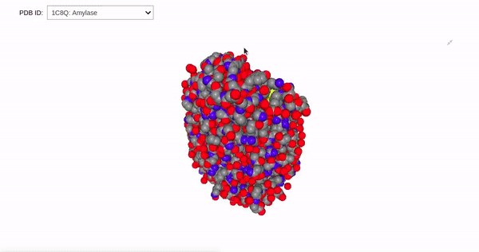

# 3-D Protein Visualizer with Biopython

## Table of Contents

<ol>
 <li><a href="#introduction">Introduction</a></li>
 <li><a href="#technologies">Technologies</a></li>
 <li><a href="#usage">Usage</a></li>
  <ol>
   <li><a href="#start-the-notebook">Start the notebook</a></li>
   <li><a href="#gui-reference">GUI reference</a></li>
     <ol>
      <li><a href="#general-features">General features</a></li>
      <li><a href="#representations">Representations</a></li>
     </ol>
  </ol>
 <li><a href="#author">Author</a></li>
 </ol>
 
## Introduction <a class="anchor" id="introduction"></a>

This project was primarily inspired by my background in molecular biology. I was excited to explore the biopython library and its uses, so I decided to create a Jupyter Notebook app.

I choose Jupyter Notebooks in part because they provide reasonable widget tooling, so making a GUI is relatively straightforward. The Notebooks are served by Binder, which remedies many of the traditional deployment challenges of Jupyter Notebooks.

While there is a small 10-20 second delay while the server spins up, Binder provides all the interactivity of a traditional Notebook but without much of the fuss.

## Technologies <a class="anchor" id="technologies"></a>
* Python
* Binder
* Jupyter notebooks
* Ipywidgets
* Biopython
* Nglview

## Usage
 The notebook is composed of cells, which are units of code. Notebook cells are meant to be executed sequentially on the first run through.
 
 To execute a cell, click on it and press ```Shift + Enter```. 
 
 Alternatively, click on a cell and click ```Run > Run Selected Cells``` or the play button in the notebook toolbar.




### Start the notebook <a class="anchor" id="start-the-notebook"></a>

1. Click the badge below to start the notebook.
    - [](https://mybinder.org/v2/gh/zachmichael14/protein_viewer/HEAD?labpath=viewer.ipynb)
    - A static version of the notebook will be displayed while the server spins up (may take up to a minute)
  
 
 
2. Run the code cell and select a protein to view from the dropdown box. The selected protein will be displayed in the cell output along with a GUI for controlling the view.


### GUI reference <a class="anchor" id="gui-reference"></a>

#### General features <a class="anchor" id="general-features"></a>

<ul>
 <li><strong>Moving the protein</strong>: click and drag to move the protein around, scroll to zoom. To reset the view, click General > Center.
  
 

 <li><strong>Changing background color</strong>: under General > Background, click the square to open the color selector. Alternatively, type in a color name or corresponding hex code.
  
  

 <li><strong>Changing representation</strong>: the current representation can most easily be changed by navigating to Extra > Quick and selecting from the list.</li>
 <ul>
  <li>Representations can stack and so will need to cycled on/off as desired.</li>
 </ul>

 
 
</ul>

#### Representations <a class="anchor" id="representations"></a>

<ul>
 <li><strong>Cartoon</strong>: typically the default as it's fairly easy to get a sense of the <a href="https://tinyurl.com/yx92469n">motifs</a> that make up the protein.</li>

 

 <li><strong>Surface</strong>: displays the molecular surface. This view is often useful for finding binding pockets within a protein. Here, it's clear that the surface representation is layered on top of the cartoon view.
  
  

 <li><strong>Spacefill</strong>: displays atoms/amino acids as spheres. This representation is commonly used in chemistry when displaying molecules.


 
</ul>

More representation details can be found <a href="https://nglviewer.org/ngl/api/manual/molecular-representations.html">here</a>.

## Author <a class="anchor" id="author"></a>

### Zachary Seitz

#### Let's connect!

* Find me on [Linkedin](https://linkedin.com/in/zachmichael14).
* Email me at zachmichael14@gmail.com.
* Visit my [resume website](https://zachmichael14.github.io/gh_page/).
